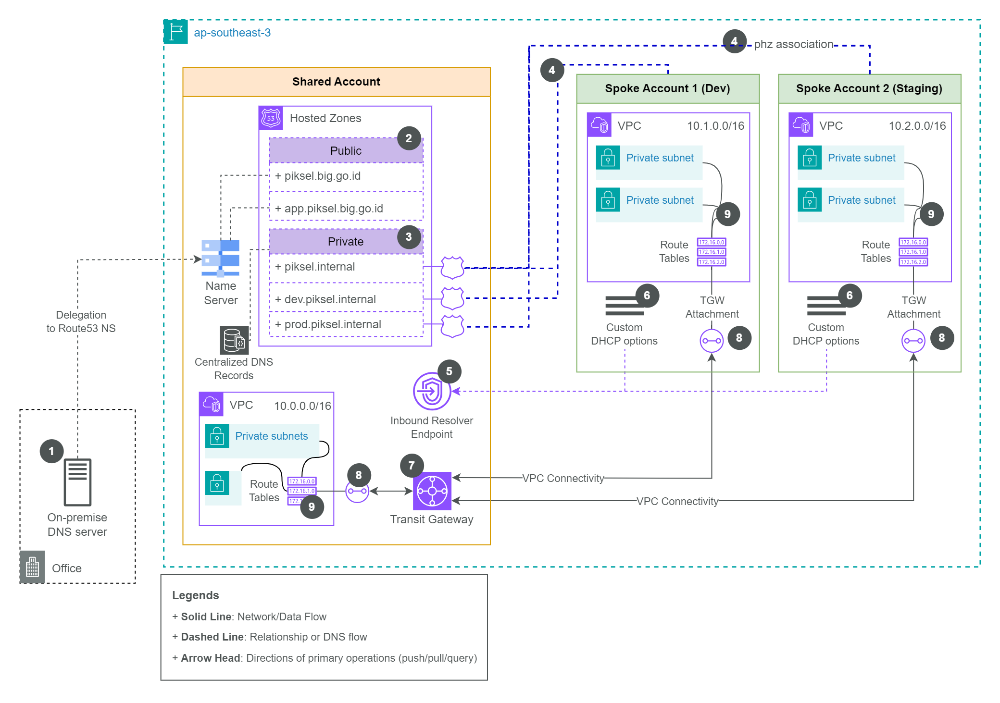

# Piksel-Hub

## Overview of Multi-Account Setup in Piksel

Piksel follows a **hub-and-spoke architecture** for its AWS infrastructure. This setup consists of:

- **Hub Account (Piksel-Hub)**: A centralized AWS account that manages shared resources such as networking, DNS, and container repositories.
- **Spoke Accounts**: Individual AWS accounts (e.g., Dev, Staging, Prod) used for running applications. These accounts consume the shared resources provisioned in the hub account.

&nbsp;<figure>

  <figcaption><i>Figure: Multi Account configuration diagram for piksel</i></figcaption>
</figure>

This architecture ensures centralized management while maintaining isolation between environments for security and scalability.

## Upstream Repository

`Piksel-Hub` is the **upstream repository** responsible for provisioning shared resources in the hub account. These resources include:

1. **Networking (Transit Gateway)**: Connects the hub VPC with spoke VPCs. Currently, its primary use is to allow spoke accounts to pull container images from the centralized Elastic Container Registry (ECR) in the hub account.
2. **DNS Management (Route 53)**: Centralized DNS records for both public and private hosted zones. This allows seamless name resolution across accounts.
3. **Private Hosted Zone (PHZ) Association**: Configures associations between private hosted zones and spoke VPCs for future use. While not actively used yet, this setup is designed to be future-proof.
4. **Container Registry (ECR)**: A shared repository for storing application container images, which are pulled by workloads in the spoke accounts.

## Practical

### 1. DNS Management

- **ExternalDNS Integration**: Applications in spoke accounts use `ExternalDNS` to dynamically update DNS records in the hub account. This ensures that DNS records are automatically managed without manual intervention.
- **Manual DNS Records**: If manual DNS records need to be added or updated, they can be configured in the `records.tfdeploy.hcl` file in the repository.

### 2. Transit Gateway

- **Current Usage**: The Transit Gateway is primarily used to enable spoke accounts to pull container images from the centralized ECR in the hub account.
- **Future Usage**: The Transit Gateway is designed to support additional use cases, such as inter-VPC communication or hybrid cloud connectivity.

### 3. Private Hosted Zone Association

- **Current State**: The private hosted zone (PHZ) association is already configured for spoke VPCs, even though it is not actively used yet.
- **Future-Proofing**: This setup allows for seamless integration of internal DNS resolution across accounts when needed in the future.

### 4. Spoke Account

Currently, we need to manually configure certain values for each spoke account in the `deployment.tfdeploy.hcl` file because variables cannot be passed from downstream (`piksel-infra`) to upstream (`piksel-hub`). Here are the key values that need to be hardcoded:

- **Spoke VPC IDs**: The IDs of the VPCs in the spoke account.

  - Example: `"vpc-0895c52245cda57ec"`

- **Spoke VPC CIDRs**: The CIDR blocks for the VPCs. Ensure each spoke account use different CIDR block.

  - Example: `"10.1.0.0/16"`

- **Cross-Account Configurations**:
  - **Environment**: The environment name (e.g., `dev`).
  - **Account ID**: The AWS account ID for the spoke account.
  - **OIDC Provider URL**: The URL for the OIDC provider used by `ExternalDNS`.
  - **Namespace and Service Account Name**: Used by `ExternalDNS` in the Kubernetes cluster.
  - **Hosted Zone Names**: The DNS zones managed in the hub account.

These values need to be manually updated for each spoke account to ensure proper integration with `piksel-hub`.
